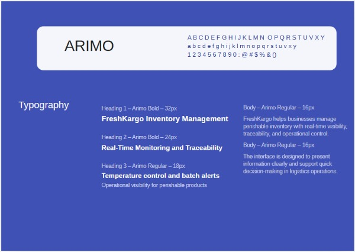
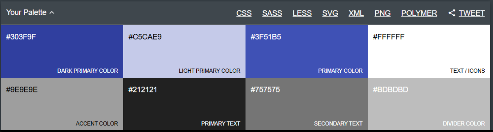
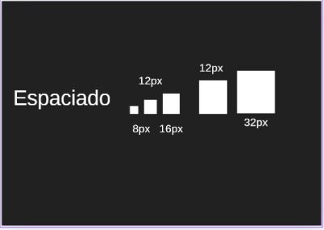
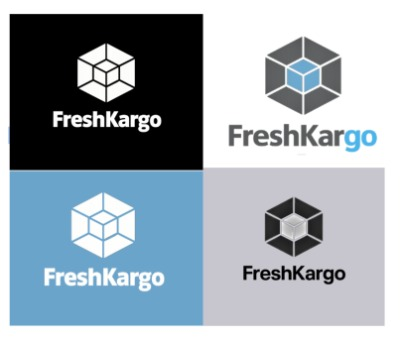
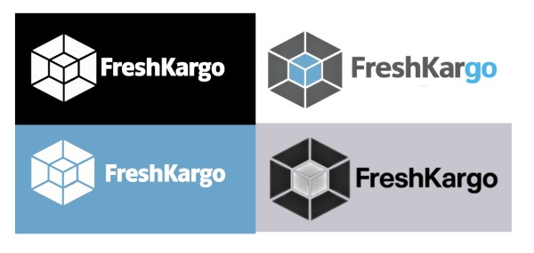
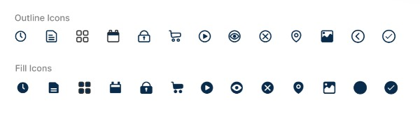
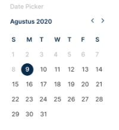
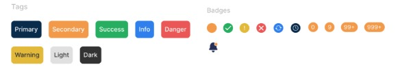
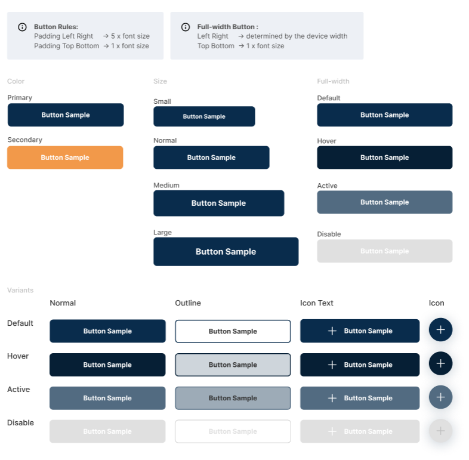

# Capítulo IV: Product Design

## 4.1. Style Guidelines

### 4.1.1. General Style Guidelines

Las siguientes pautas de estilo han sido diseñadas para garantizar la coherencia visual y comunicativa de 
FreshKargo, una plataforma orientada a la gestión de inventarios y distribución de productos perecibles. 
Estas pautas buscan asegurar una experiencia intuitiva, clara y confiable para los usuarios, especialmente 
en contextos donde el control en tiempo real, la trazabilidad y la reducción de pérdidas son factores clave.

## Tipografía
* **Fuente:** Arimo
* **Tamaños:** Seleccionar entre los tamaños disponibles para asegurar una legibilidad adecuada en diferentes 
dispositivos y tamaños de pantalla.
* **Estilos:** Utilizar estilos como negrita o cursiva para resaltar información importante.
Espaciado entre letras y líneas: Ajustar según sea necesario para mejorar la legibilidad, especialmente en textos 
largos.

## Colores principales
* **Dark Primary Color – #303F9F** → Utilizado en encabezados, elementos destacados y componentes con mayor 
peso visual.
* **Light Primary Color – #C5CAE9** → Aplicado en fondos suaves, tarjetas o secciones secundarias.
* **Primary Color – #3F51B5** → Color principal para botones, enlaces y elementos interactivos.
* **Text / Icons – #FFFFFF** → Usado en textos o íconos sobre fondos oscuros o de color principal.

## Colores neutros y utilitarios
* **Accent Color – #9E9E9E** → Empleado en detalles secundarios y elementos de apoyo visual.
* **Primary Text – #212121** → Color principal para textos informativos y contenido de lectura.
* **Secondary Text – #757575** → Aplicado en textos complementarios o de menor jerarquía.
* **Divider Color – #BDBDBD** → Utilizado en bordes, separadores y líneas divisorias.

## Significado y uso
La paleta de FreshKargo combina tonos azules y grises para transmitir confianza, organización, tecnología y 
profesionalismo. Los azules refuerzan la identidad digital del producto y su enfoque en el monitoreo y control 
en tiempo real, mientras que los tonos neutros ayudan a mantener una interfaz limpia, equilibrada y fácil de usar.

## Espaciado
* **Espaciado entre componentes:** Utilizar un sistema de espaciado basado en medidas regulares, como 8 px, 12 px, 16 px,
24 px y 32 px, para asegurar una distribución visual equilibrada y ordenada entre botones, tarjetas, formularios, 
tablas y bloques de contenido.
* **Consistencia visual:** Estas pautas de espaciado deben aplicarse de manera uniforme en toda la plataforma para 
mantener una interfaz clara, organizada y fácil de usar, especialmente en procesos de monitoreo, control y 
trazabilidad de productos perecibles.

## Escritura
* **Claridad comunicativa:** Implementar un estilo de redacción directo y comprensible que permita al usuario entender
rápidamente la información más importante dentro de la plataforma.
* **Accesibilidad lingüística:** Evitar tecnicismos innecesarios o expresiones demasiado complejas, para que la 
información sea fácil de interpretar por distintos tipos de usuarios, desde operadores logísticos hasta 
responsables de tienda.
* **Uniformidad tonal:** Mantener un estilo de comunicación homogéneo en toda la aplicación, transmitiendo orden,
confianza y soporte en la toma de decisiones.
* **Enfoque funcional:** Priorizar mensajes breves, precisos y orientados a la acción, especialmente en alertas, 
notificaciones, estados de inventario y seguimiento de incidencias.

## Branding
FreshKargo se representa mediante un logotipo geométrico y modular que transmite orden, control y organización. 
Su forma está compuesta por bloques conectados, lo que refleja la idea de una operación logística estructurada y
bien integrada.

El bloque central en color azul simboliza tecnología, confianza y monitoreo en tiempo real, mientras que las 
piezas grises representan estabilidad y soporte dentro del sistema. En conjunto, el logo comunica una plataforma 
orientada a la gestión de inventario, la trazabilidad y la conectividad de procesos.

La identidad visual de FreshKargo busca proyectar una imagen moderna, clara y funcional, alineada con una solución
digital enfocada en productos perecibles.

A partir de este concepto central, se desarrollaron distintas variaciones cromáticas del logotipo de FreshKargo
que se adaptan a diferentes contextos de comunicación:

* **Versión en blanco sobre fondo negro:** Utiliza el blanco para el símbolo y el texto, generando un contraste 
fuerte y una apariencia sobria. Esta versión transmite solidez, orden y una identidad visual clara, ideal para
presentaciones o piezas donde se busca mayor impacto.
* **Versión a color sobre fondo claro:** Mantiene el gris en la estructura externa y el azul en el bloque central, 
resaltando el equilibrio entre organización y tecnología. El gris representa estructura y soporte logístico,
mientras que el azul simboliza monitoreo, visibilidad y confianza en tiempo real.
* **Versión en blanco sobre fondo azul:** Refuerza la relación de la marca con tecnología, control y conectividad.
El uso del blanco sobre azul permite destacar el logotipo con claridad y proyecta una imagen moderna y funcional
dentro de entornos digitales.
* **Versión monocromática sobre fondo neutro:** Simplifica la identidad visual del logotipo manteniendo su forma 
geométrica esencial. Esta variación comunica sobriedad, consistencia y versatilidad, siendo útil para 
aplicaciones más formales o materiales donde se requiere una presentación visual más limpia de la marca.

La identidad visual de FreshKargo es versátil y mantiene coherencia en sus diferentes usos. Su logotipo, de forma 
geométrica y modular, transmite orden, control y conexión entre procesos. Gracias a sus variaciones cromáticas, 
la marca puede adaptarse a distintos contextos sin perder su esencia: una solución tecnológica enfocada en la 
trazabilidad, el monitoreo y la gestión eficiente de productos perecibles.

Los valores que representa son:

* Organización
* Conectividad
* Control
* Precisión
* Confianza

### 4.1.2. Web Style Guide

En esta sección se presentan las pautas visuales que definen la identidad de la interfaz web de FreshKargo. 
Estas guías permiten mantener coherencia en el diseño, mejorar la usabilidad y asegurar una experiencia clara
para los usuarios que gestionan productos perecibles.

## Iconography
* **Icon sets :**

## Selectors
El calendario es una función importante dentro de FreshKargo porque permite registrar, consultar y organizar 
información vinculada a fechas clave en la operación. **En el Segmento 1**, resulta útil para registrar fechas de 
vencimiento, programar despachos, controlar entregas y hacer seguimiento de lotes, ya que las entrevistas muestran
problemas de desfase entre el stock real y el registrado, además de pérdidas por productos vencidos o fallas
detectadas tarde. También se valora la necesidad de alertas de vencimiento, monitoreo en tiempo real y 
confirmación digital de entregas.
**En el Segmento 2**, el selector de fecha también aporta valor porque ayuda a registrar el ingreso de productos,
revisar fechas de reposición y llevar un mejor control del estado de frutas y vegetales en tienda. Esto reduce la
dependencia del registro manual y facilita que el usuario pueda ordenar mejor sus tareas sin tener que revisar
todo físicamente o estar presente todo el tiempo en el local.

## Small Elements

## Buttons

## 4.2.1 Organization Systems

### Main Pages

| Topic | Description |
|------|------------|
| Home page | General overview highlighting real-time control, loss reduction and traceability. |
| Log in | Allows users to access their account and register. |
| Technical support | Users can report issues, ask questions or request help. |

### Subscription Page

| Topic | Description |
|------|------------|
| Distributor Plan | For companies managing large volumes. Includes real-time monitoring, batch traceability and advanced reports. |
| Commerce Plan | For stores and minimarkets. Includes stock control and expiration alerts. |
| Basic Plan | Accessible option for small businesses starting digitalization. |

### Login Page

| Topic | Description |
|------|------------|
| Authentication | Secure account creation and login to access inventory and reports. |

### Other Pages & Features

| Topic | Description |
|------|------------|
| Dashboard | Shows real-time stock, alerts and operational status. |
| Inventory Management | Register products, batches, inputs and outputs. |
| Expiration Control | Shows products close to expiration. |
| Traceability & Distribution | Track products from warehouse to destination. |
| Supplier Management | Manage suppliers and restocking. |
| Settings | Customize account and system preferences. |
| Navigation Bar | Quick access to system sections. |
| Responsive Design | Works on desktop, tablet and mobile. |

---

## 4.2.2 Labeling Systems

Para el sistema de etiquetado de FreshKargo, se eligieron nombres claros y directos que
permitan a los usuarios identificar rápidamente la función de cada sección. Esto es importante
porque la plataforma está dirigida a usuarios que necesitan actuar con rapidez sobre su
inventario, sus productos por vencer y sus operaciones logísticas. Por eso, las etiquetas fueron
pensadas para ser familiares, fáciles de entender y consistentes en toda la aplicación.

| Topic | Description |
|------|------------|
| Home | General system overview. |
| Inventory | Product, batch and stock management. |
| Expiration | Identify products near expiration. |
| Distribution | Shipment and logistics tracking. |
| Suppliers | Supplier management. |
| Reports | Operational insights and metrics. |
| Support | Help center and issue reporting. |
| My Account | User settings and credentials. |

---

### 4.2.3. SEO Tags and Meta Tags

## Landing Page

- **Charset:** Define la codificación de caracteres de la página. En FreshKargo se utiliza UTF-8 para asegurar que el contenido se visualice correctamente, incluyendo tildes, la letra “ñ” y otros caracteres especiales en español.

- **Viewport (responsive):** Permite que la landing page se adapte correctamente a distintos tamaños de pantalla, mejorando la experiencia del usuario tanto en computadoras como en tablets o celulares.

- **Title (SEO):**
  `<title>FreshKargo | Gestión Inteligente de Inventarios y Distribución de Productos Perecibles</title>`

- **Meta Description:** Describe brevemente el propósito de FreshKargo y su valor para el usuario. Debe comunicar que la plataforma ayuda a controlar inventario, monitorear vencimientos y mejorar la trazabilidad de productos perecibles.

- **Meta Keywords:** inventario perecible, control de stock, productos por vencer, trazabilidad, distribución, logística alimentaria y monitoreo en tiempo real.

- **Meta Authors:** Atribuye la autoría del contenido al equipo desarrollador de FreshKargo.

- **Meta Robots:** Permite que los motores de búsqueda indexen la landing page y sigan sus enlaces.

- **Meta Language:** Indica que el contenido principal del sitio está en español.

- **Meta Copyright:** Establece la titularidad del contenido y del diseño de la página de presentación de FreshKargo.

---

## Aplicación Web

- **Charset:** Asegura que toda la interfaz del sistema muestre correctamente textos, nombres de productos, categorías, alertas y reportes.

- **Viewport (responsive):** Permite que la aplicación funcione de manera adecuada en distintos dispositivos.

- **Title (SEO):**
  `<title>FreshKargo | Panel de Gestión de Inventario y Operaciones</title>`

- **Meta Description:** Resume el contenido general del panel de control, indicando que se trata de un espacio para gestionar inventario, vencimientos, distribución y seguimiento operativo.

- **Meta Authors:** Asocia el desarrollo del sistema a la marca o equipo creador de FreshKargo.

- **Meta Robots:** Evita que buscadores indexen contenido privado o interno de la aplicación.

- **Meta Language:** Declara el español como idioma principal del panel de FreshKargo.

- **Meta Copyright:** Protege el contenido, estructura y diseño del software utilizado dentro de la plataforma.

### 4.2.4. Searching Systems

El sistema de búsqueda en FreshKargo está pensado para ayudar al usuario a encontrar
información puntual sin tener que recorrer manualmente toda la plataforma. Esto resulta
especialmente útil en operaciones donde el tiempo es importante y donde se necesita ubicar
rápidamente productos, lotes, alertas o registros de movimientos.

### Características clave

- Buscar productos por nombre, categoría o presentación.
- Encontrar lotes específicos según fecha de ingreso o fecha de vencimiento.
- Ubicar rápidamente productos con stock bajo o próximos a vencer.
- Consultar movimientos de entrada y salida dentro del inventario.
- Revisar órdenes de despacho o registros de distribución.
- Identificar proveedores asociados a determinados productos.
- Acceder de manera más rápida a reportes o datos operativos relevantes.

### Objetivo del sistema de búsqueda

La idea no es solo “buscar por buscar”, sino reducir el tiempo que el usuario invierte en tareas de control. En lugar de revisar tablas completas o registros manuales, la búsqueda permite llegar directamente a la información que necesita para tomar decisiones más rápidas y precisas.

### 4.2.5. Navigation Systems

El sistema de navegación de FreshKargo está estructurado para que el usuario pueda moverse de
manera sencilla entre las diferentes secciones del sistema, sin perderse ni depender de
demasiados pasos. La prioridad es que la navegación sea clara, ordenada y coherente con las
tareas principales de la plataforma.

### Estructura de Navegación

- **Logo — enlace al Inicio / Dashboard:** redirige siempre a la vista principal del sistema.

- **Inicio (Dashboard):**
    - Estado del inventario.
    - Alertas de productos por vencer.
    - Indicadores clave de operación.

- **Inventario:**
    - Registro de productos.
    - Gestión de lotes.
    - Entradas y salidas.
    - Consulta de stock en tiempo real.

- **Vencimientos:**
    - Visualización de productos próximos a vencer.
    - Priorización de salida de productos.
    - Alertas automáticas.

- **Distribución:**
    - Creación de órdenes de despacho.
    - Asignación de carga.
    - Seguimiento de entregas.
    - Trazabilidad de productos.

- **Proveedores:**
    - Registro de proveedores.
    - Asociación con productos.
    - Apoyo en decisiones de reabastecimiento.

- **Reportes:**
    - Indicadores de inventario.
    - Historial de movimientos.
    - Evaluación de pérdidas o mermas.

- **Planes / Suscripción:**
    - Revisar planes disponibles.
    - Comparar beneficios.
    - Gestionar suscripción.

- **Soporte:**
    - Preguntas frecuentes.
    - Contacto con soporte técnico.
    - Reporte de incidencias.

- **Buscar (Search):**
    - Encontrar productos.
    - Ubicar lotes.
    - Consultar registros o movimientos específicos.

- **Perfil / Mi cuenta:**
    - Configuración de cuenta.
    - Gestión de sesión.
    - Preferencias del sistema.

### Tipo de Navegación Implementada

- **Navegación principal persistente:** el menú principal se mantiene visible en todo momento.
- **Navegación jerárquica:** sigue una lógica de prioridad basada en las tareas principales del usuario.
- **Navegación contextual:** dentro de cada módulo se presentan opciones específicas relacionadas con la tarea actual.

# Capítulo IV: Product Design

## 4.3. Landing Page UI Design

### 4.3.1. Landing Page Wireframe

**Wireframe 1:1. Hero (Distribución Inteligente de Perecibles)**

**Wireframe 2: Servicios**

**Wireframe 3: Planes (Pricing)**

**Wireframe 4: Cómo funciona (4 pasos)**

**Wireframe 5: CTA final + Formulario**

**Wireframe 6: Agendar demo**

### 4.3.2. Landing Page Mock-up

**Mockup 1:  Hero (Distribución Inteligente de Perecibles)**

**Mockup 2: Servicios**

**Mockup 3: Como funciona(4 pasos)**

**Mockup 4: Planes (Pricing)**

**Mockup 5: CTA final + Formulario**

**Mockup 6: Agendar demo**

## 4.4. Web Applications UX/UI Design

El diseño UX/UI de FreshKargo está orientado a facilitar la gestión logística de productos perecibles mediante una interfaz clara, funcional y centrada en las necesidades de transportistas, distribuidores y propietarios de negocios. La experiencia de usuario organiza los flujos principales de la plataforma, como el monitoreo de rutas, la gestión de inventario, el control de entregas, la visualización de reportes y el registro de incidencias, permitiendo que cada usuario realice sus operaciones de forma rápida y ordenada. Por su parte, la interfaz de usuario estructura visualmente los módulos, botones, formularios, calendarios, mapas y paneles informativos para asegurar una navegación intuitiva y coherente. 

### 4.4.1. Web Applications wireframes

## 4.4.2. Web Applications mockups

### Inicio de Sesión – FreshKargo

Pantalla de acceso para usuarios registrados en FreshKargo. Permite ingresar correo electrónico y contraseña, recordar la sesión, recuperar la contraseña y acceder al registro de una nueva cuenta.

## Recuperación de Contraseña – FreshKargo

Pantalla destinada a recuperar el acceso a la cuenta. El usuario ingresa su correo electrónico para recibir un enlace seguro que le permita restablecer su contraseña.

### Registro de Cuenta – FreshKargo

Formulario para crear una cuenta nueva dentro de la plataforma. Solicita nombre completo, empresa, correo electrónico y contraseña, permitiendo que nuevos usuarios inicien la gestión de operaciones logísticas.

### Confirmación de Restablecimiento – FreshKargo

Pantalla de confirmación que informa al usuario que el enlace de recuperación de contraseña fue enviado correctamente a su correo electrónico registrado.

### Torre de Control – Dashboard – FreshKargo

Panel principal que resume el estado general de la operación, incluyendo inventario, envíos activos, cumplimiento de cadena de frío, riesgos de merma y alertas recientes.

### Inventario – Control de Productos – FreshKargo

Sección para administrar productos perecibles, controlar stock, fechas de vencimiento, lotes, temperatura de almacenamiento y alertas por bajo inventario.

### Envíos – Seguimiento Logístico – FreshKargo

Pantalla para monitorear despachos activos, rutas, entregas retrasadas, temperatura en tránsito y estado general de los envíos en tiempo real.

### Provedores – Rendimiento Operativo – FreshKargo

Panel de análisis que muestra métricas clave sobre entregas, inventario, cumplimiento de cadena de frío, reducción de desperdicios y desempeño por almacén o proveedor.

### Alertas – Monitoreo Operativo – FreshKargo

Sección para supervisar alertas críticas relacionadas con temperatura, retrasos, bajo stock, fallas de equipos e incidencias operativas que requieren atención.

### Usuarios y Roles – Administración – FreshKargo

Pantalla para gestionar usuarios del sistema, asignar roles, controlar permisos de acceso y revisar la actividad reciente dentro de la plataforma.

### Integraciones – API Hub – FreshKargo

Sección para gestionar conexiones externas de la plataforma, como ERP, GPS, servicios de correo, webhooks y herramientas de comunicación mediante APIs e integraciones.

## Inventario – Registrar Merma – FreshKargo

Ventana para registrar pérdidas o desperdicios de productos dentro del inventario. Permite ingresar el producto, lote, cantidad perdida, motivo, almacén, responsable y observaciones del incidente.

## Envíos – Crear Ruta – FreshKargo

Formulario para crear una nueva ruta logística. Permite definir el nombre de la ruta, tipo, origen, destino, duración estimada y distancia para organizar los despachos de productos perecibles.

## Envíos – Confirmar Llegada – FreshKargo

Ventana para validar la llegada de un envío a su destino. Registra el ID del despacho, hora real de llegada, temperatura final, responsable de recepción, condición del producto y notas adicionales.

## Proveedores – Realizar Pedido – FreshKargo

Formulario para solicitar abastecimiento a un proveedor. Permite seleccionar proveedor, tipo de producto, cantidad, fecha de entrega, ubicación, prioridad e instrucciones especiales del pedido.

## Alertas – Asignar Incidencia – FreshKargo

Ventana para asignar una alerta operativa a un responsable. Permite definir el encargado, prioridad y notas de atención para gestionar incidencias como retrasos, baja de stock o desviaciones de temperatura.

## Usuarios y Roles – Invitar Usuario – FreshKargo

Formulario para invitar nuevos usuarios a la plataforma. Solicita nombre completo, correo electrónico, rol y departamento, enviando una invitación con instrucciones para acceder al sistema.

## Integraciones – Credenciales API B2B – FreshKargo

Ventana para gestionar credenciales de integración empresarial. Permite visualizar datos del cliente, ambiente, Client ID, Client Secret, estado del token, IPs permitidas, límite de uso y generación de tokens API.

## Mock-ups Version Mobile

La sección de **Web Applications UX/UI Design** presenta la propuesta visual, estructural y de interacción desarrollada para la versión móvil de **FreshKargo**, plataforma orientada a la gestión logística de productos perecibles, control de inventario, monitoreo de cadena de frío, seguimiento de envíos, proveedores, alertas operativas e integraciones empresariales.

El diseño fue elaborado considerando principios de usabilidad, accesibilidad, consistencia visual y orientación a tareas, con el objetivo de que los usuarios puedan supervisar y gestionar operaciones logísticas desde dispositivos móviles de manera rápida y eficiente. La propuesta UI/UX prioriza una experiencia clara, ordenada y funcional, permitiendo consultar indicadores clave, registrar incidencias, administrar productos, controlar despachos y responder alertas en tiempo real.

  
### 4.4.2. Web Applications Wireflow Diagrams.
Los Wireflows se emplean principalmente en el diseño de la experiencia de usuario (UX) y son especialmente útiles para aplicaciones que incluyen flujos de trabajo e interacciones complejas.

### 4.4.3. Web Applications Mock-ups

En esta sección se presentan los mock-ups diseñados para la aplicación web de FreshKargo. Cada pantalla responde a las funcionalidades principales del sistema y a las necesidades operativas de los usuarios, enfocándose en la gestión de inventario, control de vencimientos, distribución y monitoreo en tiempo real de productos perecibles.

## 4.4.4. Web Applications User Flow Diagrams

El *user flow* es la representación visual del camino que un usuario sigue dentro de la aplicación FreshKargo para alcanzar un objetivo específico. Estos diagramas son esenciales para asegurar que la navegación sea lógica, intuitiva y libre de obstáculos, garantizando una experiencia de usuario satisfactoria y eficiente para las tareas clave de la plataforma, como la gestión de inventario, control de vencimientos, distribución, monitoreo y revisión de reportes operativos.

## Objetivo 1: Un usuario desea crear una cuenta y recuperar el acceso a FreshKargo.

El flujo muestra el proceso inicial de acceso a la plataforma FreshKargo. El usuario puede ingresar desde la pantalla de inicio de sesión, crear una nueva cuenta mediante el formulario de registro y, en caso de olvidar su contraseña, solicitar un enlace de recuperación a través de su correo electrónico. Finalmente, el sistema confirma el envío del enlace para que el usuario pueda restablecer sus credenciales y volver a acceder a la plataforma.

## Objetivo 2: Un usuario desea gestionar y monitorear la operación logística dentro de FreshKargo.

Este flujo muestra cómo el usuario navega a través de las principales secciones del sistema para supervisar y gestionar la operación. Inicia en el dashboard (Control Tower), donde visualiza indicadores clave del estado del inventario y envíos. Luego, accede a la sección de inventario para revisar productos, stock y vencimientos. Posteriormente, navega a envíos para monitorear despachos y su estado en tiempo real. También consulta la sección de proveedores para evaluar su desempeño y gestionar relaciones de abastecimiento. Finalmente, accede a analytics, donde analiza métricas, tendencias y reportes que apoyan la toma de decisiones operativas.

## Objetivo 3: Un administrador desea gestionar alertas, usuarios e integraciones en FreshKargo.

Este flujo muestra cómo el administrador supervisa y configura aspectos clave del sistema. Inicia en la sección de alertas, donde visualiza e identifica incidencias relacionadas con la operación. Luego, accede al módulo de usuarios y roles para registrar nuevos usuarios y asignar permisos según sus funciones. Posteriormente, navega a la sección de integraciones para configurar y activar servicios externos que complementan la plataforma. Finalmente, puede regresar a módulos operativos como inventario o envíos para aplicar los cambios realizados dentro del sistema.

## Objetivo 4: Un usuario desea registrar desperdicios y gestionar productos dentro del inventario en FreshKargo.

Este flujo muestra cómo el usuario interactúa con la sección de inventario para registrar eventos operativos. Primero, accede a la opción de registrar desperdicio (“Register Waste”), donde completa la información correspondiente sobre el producto afectado. Luego, puede continuar con la gestión del inventario creando órdenes de despacho mediante la opción “Create Order”. Finalmente, tiene la posibilidad de agregar nuevos productos al sistema completando el formulario correspondiente, asegurando que el inventario se mantenga actualizado y correctamente gestionado.

## Objetivo 5: Un usuario desea editar y actualizar la información de un producto en el inventario de FreshKargo.

Este flujo muestra cómo el usuario gestiona la actualización de datos dentro del inventario. Inicia en la sección de inventario, donde selecciona un producto y accede a la opción de edición (“Edit Product”). A continuación, el sistema muestra un formulario donde el usuario puede modificar información relevante como nombre, categoría, stock o configuraciones del producto. Una vez realizados los cambios, guarda la información y el sistema actualiza los datos, reflejando los cambios en la lista de productos del inventario.

## Objetivo 6: Un usuario desea crear envíos y asignar recursos logísticos en FreshKargo.

Este flujo muestra cómo el usuario gestiona el proceso de distribución desde la sección de envíos. Primero, accede a la opción de crear un nuevo envío (“Create Shipment”) e ingresa la información correspondiente. Luego, asigna un vehículo y un conductor para realizar la entrega. Finalmente, puede crear o configurar una ruta logística, asegurando que el envío se realice de manera organizada, eficiente y con trazabilidad dentro del sistema.

## Objetivo 7: Un usuario desea gestionar la confirmación, rechazo y validación de entregas en FreshKargo.

Este flujo muestra cómo el usuario controla el estado final de los envíos dentro del sistema. Primero, puede confirmar la llegada del envío (“Confirm Arrival”) registrando información como tiempo y condiciones de entrega. En caso de incidencias, tiene la opción de rechazar el envío completando el motivo correspondiente. Finalmente, el usuario puede registrar la prueba de entrega (“Proof of Delivery”), ingresando datos del receptor y evidencia necesaria, asegurando la trazabilidad y validación completa del proceso de distribución.

## Objetivo 8: Un administrador desea gestionar proveedores, usuarios y asignación de alertas en FreshKargo.

Este flujo muestra cómo el administrador configura y supervisa elementos clave del sistema. Primero, puede generar órdenes de abastecimiento desde la sección de proveedores (“Place Order”). Luego, accede al módulo de usuarios para invitar nuevos miembros al sistema y asignarles roles según sus responsabilidades. Posteriormente, gestiona alertas operativas asignándolas a usuarios específicos para su resolución. Finalmente, registra nuevos proveedores y asocia productos con ellos, asegurando una correcta gestión del abastecimiento y la relación con la cadena de suministro.

## Objetivo 9: Un administrador desea configurar y gestionar integraciones y APIs en FreshKargo.

Este flujo muestra cómo el administrador interactúa con el módulo de integraciones para conectar sistemas externos. Primero, genera y gestiona credenciales API necesarias para la comunicación con servicios externos. Luego, configura webhooks definiendo eventos y destinos para automatizar notificaciones en tiempo real. Posteriormente, consulta la documentación de endpoints disponibles para integrar funcionalidades específicas. Finalmente, revisa los registros de actividad de la API (logs) para monitorear solicitudes, validar estados y asegurar el correcto funcionamiento de las integraciones dentro del sistema.

## 4.5. Web Applications Prototyping

Link del video : 

https://drive.google.com/file/d/1idGuoLw1ZsSrOwcTgkEPcY9UqwHDRhck/view?usp=sharing

### 4.6. Domain-Driven Software Architecture

El Diseño Orientado al Dominio (DDD) en FreshKargo se enfoca en representar dentro del
software los procesos principales del negocio, como la gestión de inventario, el control de
vencimientos, la trazabilidad y la distribución de productos perecibles. Este enfoque permite que
la estructura del sistema esté alineada con las necesidades reales de los usuarios y facilita su
escalabilidad y mantenimiento.

   
### 4.6.2. Software Architecture Context Diagram

En este nivel se presenta una vista de alto nivel de la arquitectura, donde el foco está en el sistema de software FreshKargo como una "caja negra" y en las interacciones que mantiene con sus usuarios y con otros sistemas externos.

El context diagram muestra al FreshKargo como un recuadro en el centro, rodeado por los principales actores y sistemas con los que se comunica:

* Logistics Manager: usuario interno responsable de gestionar el inventario de perecibles, asignar rutas, vehículos y monitorear la cadena de frío desde el panel de control.
* Merchant: usuario externo (Comerciante Mayorista/Minorista) que utiliza la plataforma para rastrear el estado de sus pedidos, verificar las condiciones de llegada y registrar firmas de conformidad o rechazos.
* Carrier: usuario (Transportista) que interactúa con el sistema durante las rutas para registrar actualizaciones de estado, enviar ubicación y capturar las pruebas de entrega (POD).
* Merchant ERP Systems: sistemas externos de los clientes B2B que consumen la API de FreshKargo para sincronizar catálogos, trazabilidad de despachos y recibir webhooks de alertas.
* Payment System (Stripe): sistema externo encargado de procesar suscripciones, cobros y facturación asociados al uso de la plataforma logística.
* Google Maps API: servicio de mapas utilizado para geolocalización de vehículos, cálculo de rutas y validación de direcciones de entrega.
* Notification Service: servicio externo (ej. SendGrid / Twilio) utilizado para el envío de notificaciones transaccionales (alertas de ruptura de frío, recordatorios, SMS a choferes) a los usuarios.

En el diagrama se representan las relaciones entre estos elementos, destacando que los usuarios y los ERP externos interactúan directamente con FreshKargo. El sistema se encarga de orquestar las integraciones con servicios en la nube (pagos, mapas y notificaciones). Esta vista permite entender el alcance del sistema logístico y los límites de responsabilidad antes de entrar a detalles de implementación.

### 4.6.3. Software Architecture Container Diagrams

En el nivel de contenedores, la atención se desplaza desde "quién usa el sistema" hacia "cómo se organiza internamente el sistema en aplicaciones y fuentes de datos". El container diagram muestra los elementos de alto nivel de la arquitectura de FreshKargo, sus responsabilidades principales y la forma en que se comunican entre sí y con los sistemas externos.

La arquitectura lógica de FreshKargo se estructura en los siguientes contenedores:

* Landing Page: aplicación web estática que presenta la propuesta de valor de FreshKargo, guía a nuevos usuarios y redirige a la aplicación principal. Está desarrollada con tecnologías web estándar (HTML, CSS y JavaScript) y se despliega en un entorno orientado a contenido estático.
* Single Page Application (SPA): aplicación web principal, implementada en Angular, donde interactúan el Logistics Manager y el Merchant. Este contenedor concentra la experiencia de usuario, las vistas y la lógica de presentación para los diferentes contextos del dominio (inventario, monitoreo de rutas, reportes, etc.).
* Mobile Application: aplicación móvil desarrollada en Flutter, diseñada específicamente para el Carrier. Permite emitir coordenadas GPS en segundo plano, registrar paradas, capturar fotografías para incidencias y firmas digitales (POD).
* API Application: backend implementado con Spring Boot, que expone una API REST y encapsula la lógica de negocio, reglas de validación y orquestación de procesos. Este contenedor agrupa los módulos backend por contexto (IAM, Distribution, Inventory, Analytics, Notifications, Payments y Shared).
* Database: base de datos relacional PostgreSQL, donde se persiste la información estructurada del sistema: usuarios, inventario perecible, proveedores, órdenes de despacho, telemetría y pagos.

En el diagrama se observa que los usuarios acceden primero a la Landing Page, la cual redirige a la SPA tras la autenticación, o directamente a la Mobile App en el caso del transportista. La SPA y la Mobile App se comunican exclusivamente con la API Application mediante peticiones HTTP/HTTPS con mensajes JSON, siguiendo un estilo REST. La API Application persiste y consulta datos en la Database mediante JDBC y mapeo objeto-relacional, e interactúa de forma directa con los sistemas externos (pagos, mapas, notificaciones y ERPs B2B).

Esta vista permite apreciar cómo se distribuyen las responsabilidades entre la capa de presentación (Landing, SPA, Mobile App), la capa de lógica de negocio (API Application) y la capa de persistencia (Database), así como las principales decisiones tecnológicas que se han tomado para cada contenedor.

### 4.6.4. Software Architecture Components Diagrams

En el nivel de componentes se detalla la descomposición interna de los contenedores, mostrando los bloques estructurales que conforman cada uno y las relaciones entre ellos. Dado que las aplicaciones de cliente y la base de datos se describieron en apartados previos, en esta sección se pone especial énfasis en el contenedor API Application, donde reside la mayor parte de la lógica de negocio y las reglas de integración.

El component diagram de la API Application agrupa la arquitectura interna siguiendo estrictamente los Bounded Contexts (BC) definidos en el diseño orientado a objetos del sistema. Cada módulo backend representa un componente principal dentro del contenedor:

* Identity & Access Management (BC1): se encarga de la autenticación, autorización, gestión de usuarios, roles, perfiles de usuario y el manejo de sesiones mediante tokens JWT.
* Inventory Management (BC2): gestiona el catálogo de productos perecibles, el control de lotes, almacenes, movimientos de stock, registros de mermas (waste) y la configuración de umbrales térmicos.
* Shipments & Dispatch (BC3): implementa la lógica central de distribución. Gestiona las órdenes de despacho, rutas, vehículos, conductores, incidentes en ruta, lectura de telemetría y la captura de las pruebas de entrega (POD).
* Supplier & Replenishment (BC4): administra el directorio de proveedores, el catálogo de productos por proveedor y automatiza las solicitudes de reabastecimiento cuando el inventario es bajo.
* Alerts & Monitoring (BC5): procesa las reglas de negocio para la cadena de frío. Gestiona las alertas de temperatura, colas de escalamiento, preferencias de notificación y dispara los avisos por correo o SMS hacia los usuarios.
* API Hub & Integrations (BC6): centraliza la comunicación con sistemas B2B externos. Administra credenciales de API, registros de peticiones (ApiLogs) y las suscripciones a Webhooks para los Merchant ERP Systems.
* Shared / Core Backend: provee componentes transversales, utilidades comunes, manejo global de excepciones y mecanismos de infraestructura (como repositorios base) reutilizados por todos los demás módulos.

En el diagrama se refleja cómo los controladores de cada componente consumen los servicios internos y cómo estos se comunican con la base de datos para persistir la información. Además, se visualiza la interacción del API Hub y el módulo de Alertas con servicios externos para tareas específicas como el envío de notificaciones y la sincronización B2B.

# Database Diagrams

En esta sección el equipo presenta y explica el Database Diagram que incluye los objetos de base de datos que permitirán la persistencia de información para los objetos de cada bounded context. Para el caso de un almacenamiento en base de datos relacional, se especifican tablas, columnas, constraints (por ejemplo, primary, foreign key) y se evidencian las relaciones entre tablas.

## Frontend Architecture Diagram
El siguiente diagrama ilustra la arquitectura y estructura de componentes del lado del cliente (Frontend). Se detalla la organización de los Pages/Components, ViewModels, Services y DTOs (Data Transfer Objects), permitiendo visualizar el flujo de datos y la interacción entre las diferentes capas de la interfaz de usuario.

{width=100%}

## Backend Database Diagram
El siguiente diagrama entidad-relación (ERD) corresponde al diseño de base de datos del servidor (Backend). El diagrama modela la estructura de almacenamiento relacional para cada *bounded context*, detallando de manera específica las tablas, sus columnas, constraints (como claves primarias y foráneas), y las relaciones y multiplicidades existentes entre las diversas entidades del sistema.

{width=100%}
